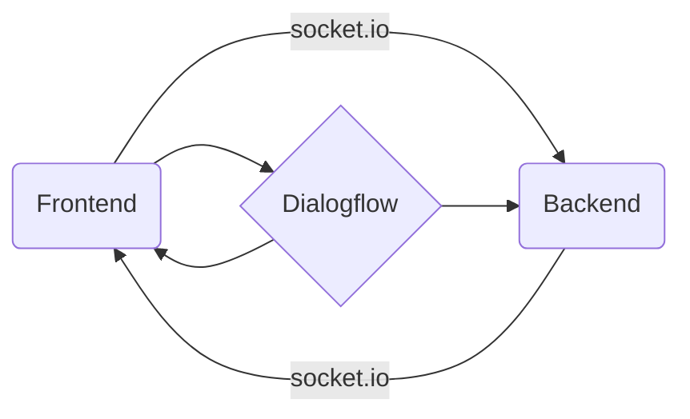

# Moon voice assistant

A prototype of my idea to improve website accessibility.
The app allows you to navigate through website ousing voice or written interface and search for information in more user firendly way.

Click to see in action:

## Architecture

The app consists of 3 parts.

The language processing part is done with the help of Dialogflow API.  
The Backend is a simple Node.js server connected with frontend through socket.io.
There are two types of predefined intents:

- basic information request - is handled by Dialogflow API. When the intent is interpreted coreclty, User receives the predefined response

- UI controlling intent - such as changing the frontend route - is passed to the backend as a request to a corresponding route handler. Route controller triggers socket.io event which is passed to the frontend part and then prompts UI change.
